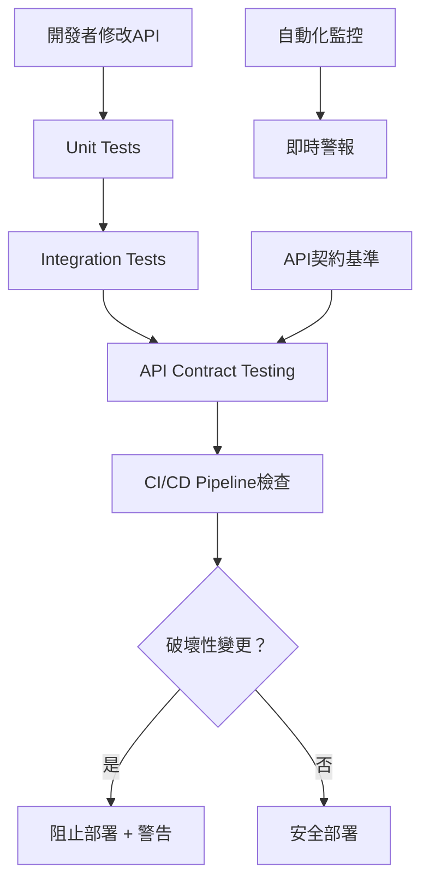

# Pikachu API 保護機制實作指南

## 📋 文件資訊

| 項目 | 內容 |
| --- | --- |
| 目的 | 防止API變更破壞client端，確保API向後相容性 |
| 負責人 | 開發團隊 |
| 建立日期 | 2025-07-17 |
| 狀態 | 🟡 規劃中 |
| 優先級 | 🔴 高 |

## 🎯 問題背景

### 核心問題
如何測試API以防止變更破壞API並使client端也無法正常運作？

### 現狀挑戰
- API修改可能意外破壞現有的client端應用
- 缺乏自動化檢測破壞性變更的機制
- Unit Test無法完全保證API合約的完整性
- 部署後才發現API問題，影響用戶體驗

## 🏗️ 解決方案架構

### 多層保護策略



## 📊 實作層級

### Level 1: 基礎保護
- ✅ Unit Tests (已有)
- 🟡 Integration Tests (待實作)
- 🟡 API契約基準建立

### Level 2: 進階保護
- 🟡 契約變更自動檢測
- 🟡 破壞性變更警告
- 🟡 CI/CD Pipeline整合

### Level 3: 完整保護
- 🟡 自動化監控
- 🟡 即時警報系統
- 🟡 回滾機制

## 🛠️ 技術實作

### 1. API契約基準建立

#### 目標
儲存當前API的OpenAPI規格作為基準，用於比較未來的變更。

#### 實作步驟

```bash
# 1. 啟動Blazor應用程式
cd src/Kooco.Pikachu.Blazor
dotnet run

# 2. 擷取API契約
curl http://localhost:5000/swagger/v1/swagger.json > api-contracts/baseline.json

# 3. 建立契約比較腳本
pwsh scripts/api-protection/compare-contracts.ps1
```

#### 預期產出
- `api-contracts/baseline.json` - API基準契約
- 契約版本控制機制
- 自動化契約擷取腳本

### 2. Integration Tests 實作

#### 目標
測試真實的HTTP API呼叫，確保完整的請求→響應流程正常運作。

#### 核心測試案例

```csharp
[Test]
public async Task API_Items_Create_Should_Return_Valid_Response()
{
    // Arrange
    var client = _factory.CreateClient();
    var request = new CreateItemDto { /* ... */ };
    
    // Act
    var response = await client.PostAsJsonAsync("/api/items", request);
    
    // Assert
    response.StatusCode.ShouldBe(HttpStatusCode.Created);
    var result = await response.Content.ReadFromJsonAsync<ItemDto>();
    result.ShouldNotBeNull();
    result.Id.ShouldNotBe(Guid.Empty);
}
```

#### 測試覆蓋範圍
- **Items API**: Create, Read, Update, Delete
- **Orders API**: 訂單建立、狀態更新
- **SetItems API**: 套餐商品管理
- **Members API**: 會員註冊、登入
- **錯誤處理**: 各種錯誤狀況的API響應

### 3. 契約變更檢測

#### 自動化檢測腳本

```powershell
# scripts/api-protection/check-contract-changes.ps1

# 取得當前API契約
$currentContract = Invoke-RestMethod "http://localhost:5000/swagger/v1/swagger.json"

# 載入基準契約
$baselineContract = Get-Content "api-contracts/baseline.json" | ConvertFrom-Json

# 比較契約差異
$changes = Compare-ApiContracts $baselineContract $currentContract

# 檢測破壞性變更
if ($changes.BreakingChanges.Count -gt 0) {
    Write-Error "發現破壞性變更！"
    $changes.BreakingChanges | ForEach-Object { Write-Host $_ -ForegroundColor Red }
    exit 1
}
```

#### 破壞性變更定義
- 移除API端點
- 修改HTTP方法
- 移除必要參數
- 修改響應格式結構
- 修改錯誤代碼

#### 非破壞性變更
- 新增API端點
- 新增可選參數
- 新增響應欄位
- 修改內部實作

### 4. CI/CD Pipeline 整合

#### GitHub Actions 工作流程

```yaml
name: API Protection Pipeline

on:
  pull_request:
    branches: [ main ]
  push:
    branches: [ main ]

jobs:
  api-protection:
    runs-on: ubuntu-latest
    
    steps:
    - uses: actions/checkout@v3
    
    - name: Setup .NET
      uses: actions/setup-dotnet@v3
      with:
        dotnet-version: '9.0.x'
    
    - name: Restore dependencies
      run: dotnet restore
    
    - name: Run Unit Tests
      run: dotnet test test/Kooco.Pikachu.Application.Tests/
    
    - name: Build Application
      run: dotnet build src/Kooco.Pikachu.Blazor/
    
    - name: Start API for Testing
      run: |
        dotnet run --project src/Kooco.Pikachu.Blazor &
        sleep 30
    
    - name: Run Integration Tests
      run: dotnet test test/Kooco.Pikachu.API.Tests/
    
    - name: Check API Contract Changes
      run: pwsh scripts/api-protection/check-contract-changes.ps1
    
    - name: Generate Contract Report
      if: failure()
      run: pwsh scripts/api-protection/generate-report.ps1
```

## 📋 實作時程

### Phase 1: 基礎建設 (週1)
- [ ] 修復現有Unit Tests
- [ ] 建立API契約基準
- [ ] 創建Integration Tests專案
- [ ] 實作核心API測試

### Phase 2: 自動化檢測 (週2)
- [ ] 開發契約比較工具
- [ ] 實作破壞性變更檢測
- [ ] 建立CI/CD Pipeline
- [ ] 設定自動化測試

### Phase 3: 監控與警報 (週3)
- [ ] 實作即時監控
- [ ] 建立警報機制
- [ ] 創建Dashboard
- [ ] 效能監控整合

### Phase 4: 完善與優化 (週4)
- [ ] 測試覆蓋率優化
- [ ] 效能調優
- [ ] 文件完善
- [ ] 團隊培訓

## 🎯 成功指標

### 技術指標
- API測試覆蓋率: >90%
- 破壞性變更檢測率: 100%
- 假陽性率: <5%
- CI/CD Pipeline執行時間: <10分鐘

### 業務指標
- Production API錯誤減少: >80%
- Client端相容性問題: 接近零
- 部署回滾次數: <1/月
- 開發效率提升: 可衡量

## 🚨 風險與緩解

### 主要風險

| 風險 | 影響 | 機率 | 緩解策略 |
| --- | --- | --- | --- |
| 假陽性警報過多 | 開發效率下降 | 中 | 精確定義破壞性變更規則 |
| CI/CD Pipeline過慢 | 部署延遲 | 中 | 並行測試、快取優化 |
| 測試維護成本高 | 資源消耗 | 低 | 自動化測試生成 |
| 團隊接受度低 | 實作阻力 | 低 | 培訓、漸進式導入 |

## 📚 相關資源

### 技術文件
- [OpenAPI規格說明](https://swagger.io/specification/)
- [ASP.NET Core Integration Testing](https://docs.microsoft.com/en-us/aspnet/core/test/integration-tests)
- [GitHub Actions文件](https://docs.github.com/en/actions)

### 工具與框架
- **測試框架**: xUnit, Shouldly
- **API測試**: ASP.NET Core TestServer
- **契約比較**: 自訂PowerShell腳本
- **CI/CD**: GitHub Actions
- **監控**: Application Insights (可選)

## 👥 團隊責任

### 開發團隊
- 實作Integration Tests
- 維護API契約基準
- 遵循API設計規範

### DevOps團隊
- 設定CI/CD Pipeline
- 配置監控和警報
- 維護基礎設施

### 產品團隊
- 定義API相容性需求
- 審核破壞性變更
- 制定發布策略

## 📝 下一步行動

### 立即行動 (本週)

1. **執行API保護設置腳本**
   ```bash
   pwsh scripts/setup-api-protection.ps1
   ```

2. **建立API契約基準**
   - 啟動Blazor應用程式
   - 擷取Swagger JSON
   - 版本控制基準檔案

3. **創建第一個Integration Test**
   - Items API基本CRUD測試
   - 驗證測試執行成功

### 短期目標 (下週)
- 完成核心API的Integration Tests
- 實作契約變更檢測
- 設定基本的CI/CD檢查

### 中期目標 (下月)
- 完整的自動化保護機制
- 監控和警報系統
- 團隊培訓和文件完善

## 📞 聯絡資訊

如有任何問題或建議，請聯絡：

- **技術負責人**: [開發團隊]
- **專案經理**: [專案團隊]
- **Confluence空間**: PI - Pikachu

---

*最後更新: 2025-07-17 版本: 1.0*