# Pikachu 系統架構文檔

## 架構概述

Pikachu 電商平台採用基於 ABP Framework 的分層架構設計，遵循領域驅動設計（DDD）原則。系統使用 Blazor Server 作為前端技術，提供即時互動的使用者體驗，後端則採用 .NET 9 構建高效能的 API 服務。

### 架構特點

- **分層架構**：清晰的層次劃分，各層職責明確
- **領域驅動**：業務邏輯集中在領域層
- **模組化設計**：功能模組獨立，易於擴展
- **多租戶支援**：原生支援 SaaS 模式
- **微服務就緒**：可輕易拆分為微服務架構

## 系統架構圖

### 整體架構

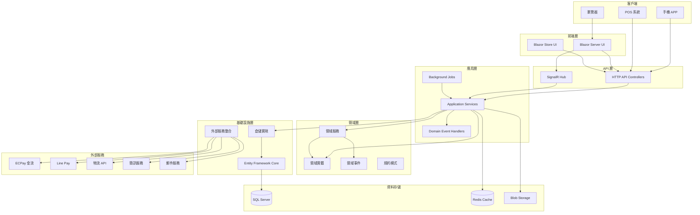

### DDD 分層架構

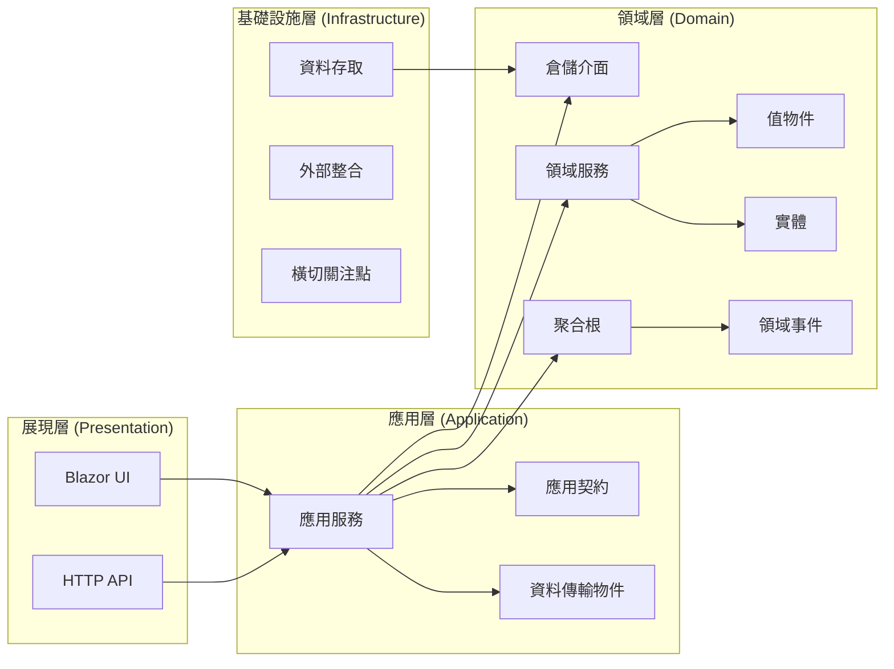

## 主要元件說明

### 1. 展現層 (Presentation Layer)

#### Blazor Server UI
- **職責**：提供互動式的網頁介面
- **技術**：Blazor Server、SignalR
- **元件庫**：AntDesign Blazor、MudBlazor
- **特點**：
  - 即時 UI 更新
  - 減少客戶端負載
  - 統一的元件化開發

#### HTTP API Controllers
- **職責**：提供 RESTful API 端點
- **技術**：ASP.NET Core Web API
- **特點**：
  - 自動 API 文檔生成
  - 統一的錯誤處理
  - API 版本管理

### 2. 應用層 (Application Layer)

#### Application Services
- **職責**：協調業務流程，處理用例
- **範例**：
```csharp
public class OrderAppService : ApplicationService, IOrderAppService
{
    public async Task<OrderDto> CreateOrderAsync(CreateOrderDto input)
    {
        // 驗證輸入
        // 調用領域服務
        // 發布領域事件
        // 返回 DTO
    }
}
```

#### Background Jobs
- **職責**：處理非同步任務
- **技術**：Hangfire
- **任務類型**：
  - 訂單狀態同步
  - 庫存檢查
  - 報表生成
  - 郵件發送

### 3. 領域層 (Domain Layer)

#### 聚合根 (Aggregate Roots)
- **GroupBuy**：團購聚合根
- **Order**：訂單聚合根
- **Item**：商品聚合根
- **Member**：會員聚合根

#### 領域服務 (Domain Services)
- **OrderManager**：訂單業務邏輯
- **InventoryManager**：庫存管理
- **PricingService**：價格計算
- **PromotionEngine**：促銷引擎

#### 領域事件 (Domain Events)
```csharp
public class OrderCreatedEvent : DomainEventBase
{
    public Guid OrderId { get; set; }
    public string OrderNo { get; set; }
    public decimal TotalAmount { get; set; }
}
```

### 4. 基礎設施層 (Infrastructure Layer)

#### Entity Framework Core
- **DbContext**：資料庫上下文
- **Migrations**：資料庫遷移
- **配置**：Fluent API 配置

#### 外部服務整合
- **支付整合**：ECPay、LinePay、中國信託
- **物流整合**：黑貓、7-11、全家
- **通知服務**：簡訊、Email

## 資料流程圖

### 訂單建立流程

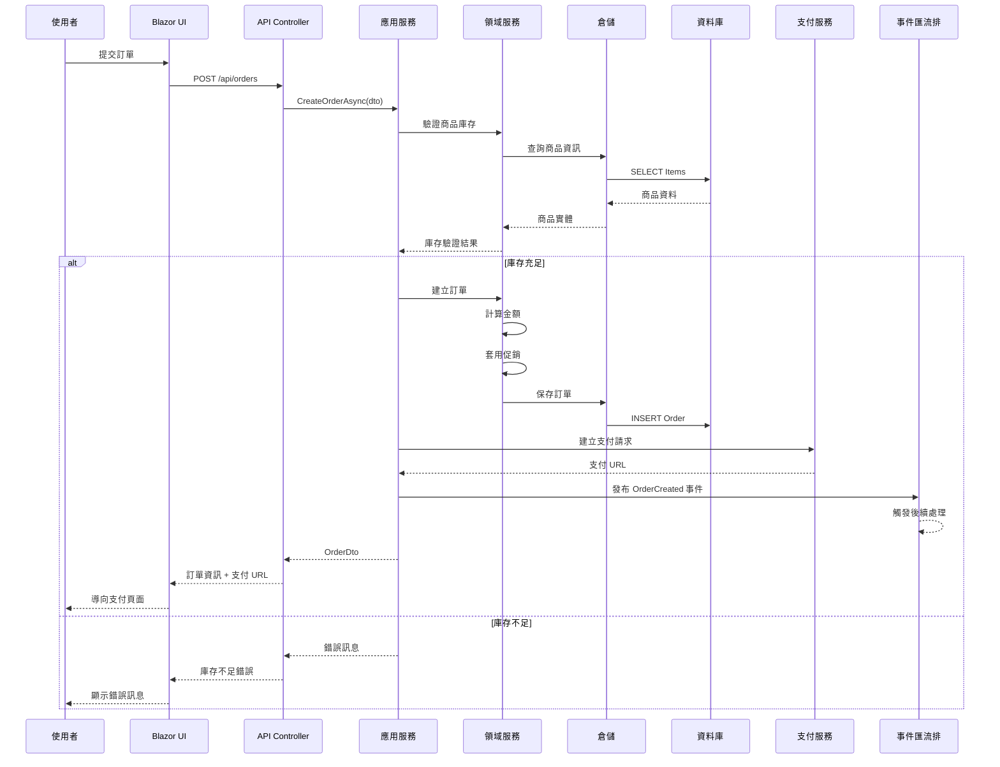

### 支付回調流程

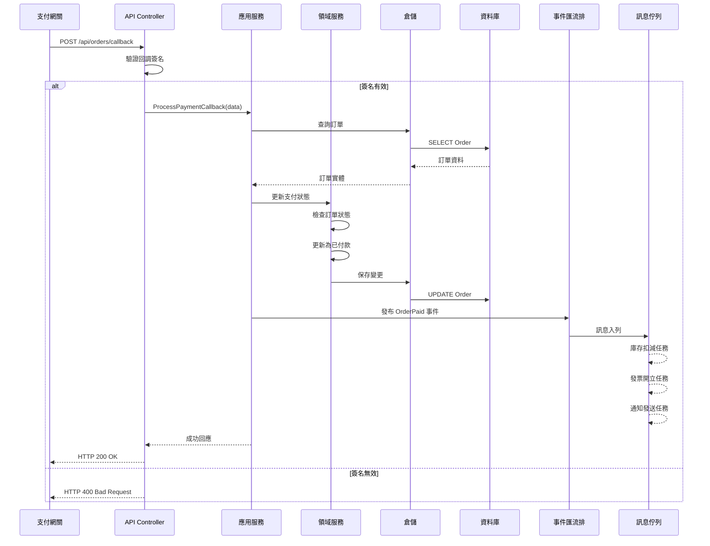

## 時序圖

### 團購商品查詢

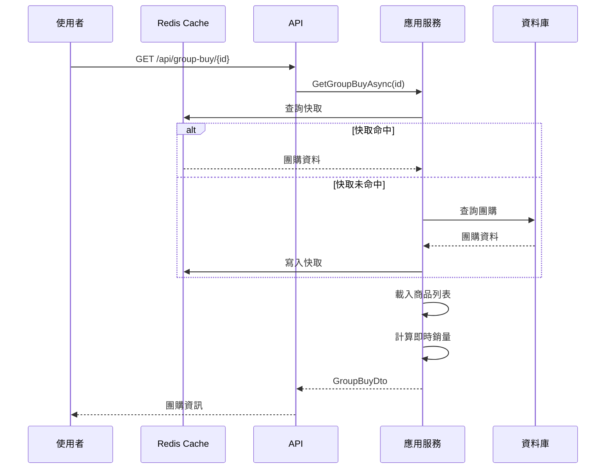

### 購物車結帳

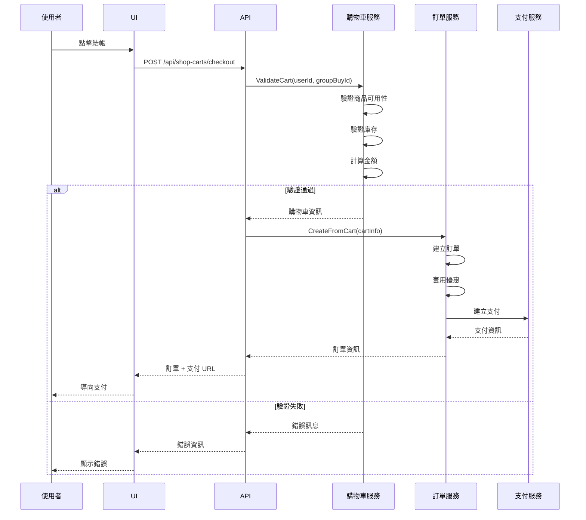

## 模組依賴關係

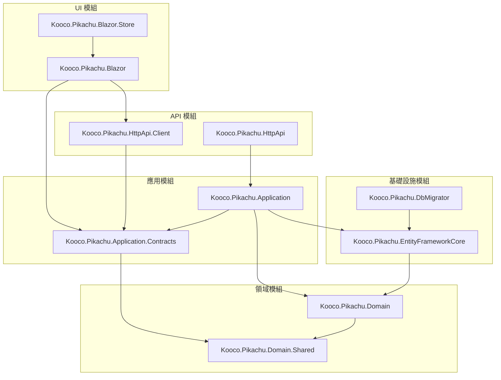

## 部署架構

### 生產環境部署

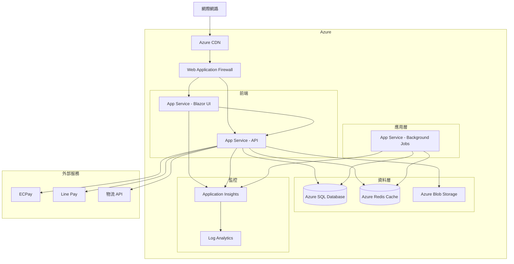

### 容器化部署

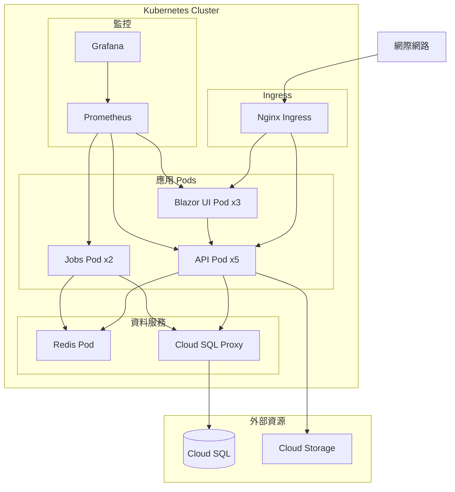

## 安全架構

### 安全層級

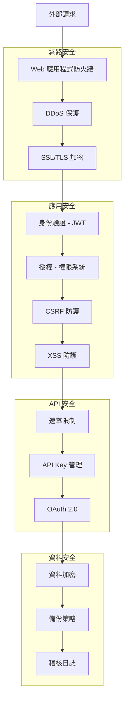

## 效能優化架構

### 快取策略

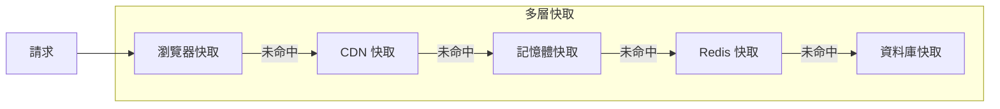

### 非同步處理

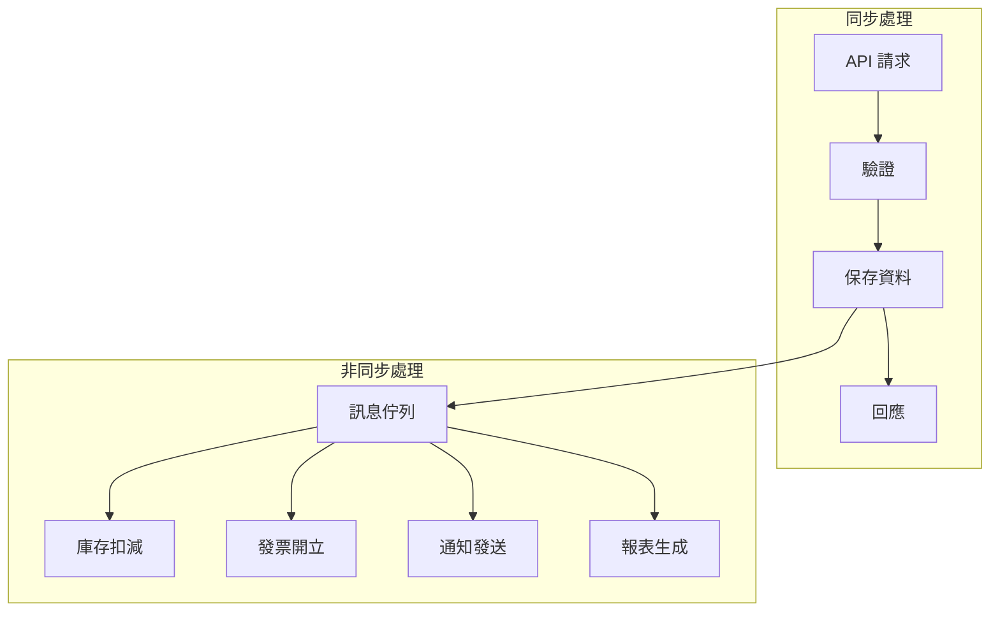

## 擴展性設計

### 水平擴展

1. **無狀態設計**
   - Session 存儲在 Redis
   - 檔案存儲在 Blob Storage
   - 分散式快取

2. **負載均衡**
   - Application Gateway
   - 健康檢查端點
   - 自動擴展規則

3. **資料庫擴展**
   - 讀寫分離
   - 分片策略
   - 連線池管理

### 垂直擴展

1. **模組化架構**
   - 獨立部署單元
   - 清晰的介面定義
   - 鬆耦合設計

2. **插件系統**
   - 動態載入模組
   - 擴展點設計
   - 事件驅動架構

## 監控與維運

### 監控架構

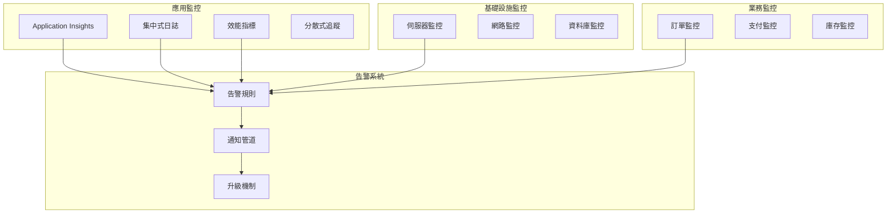

### 健康檢查

```csharp
// 健康檢查端點配置
services.AddHealthChecks()
    .AddSqlServer(connectionString, name: "sql")
    .AddRedis(redisConnection, name: "redis")
    .AddUrlGroup(new Uri("https://api.ecpay.com.tw/health"), name: "ecpay")
    .AddCheck<CustomHealthCheck>("custom");
```

## 災難復原

### 備份策略

1. **資料備份**
   - 自動備份：每日
   - 保留期限：30 天
   - 異地備份：啟用

2. **應用備份**
   - 程式碼：Git 版控
   - 配置：Azure Key Vault
   - 容器映像：Container Registry

3. **復原計劃**
   - RTO：< 4 小時
   - RPO：< 1 小時
   - 定期演練：每季

## 技術債管理

### 識別與追蹤

1. **程式碼品質**
   - SonarQube 分析
   - 程式碼覆蓋率
   - 技術債指標

2. **架構適應性**
   - 定期架構審查
   - 效能基準測試
   - 擴展性評估

3. **優先級管理**
   - 影響評估矩陣
   - 改善計劃
   - 資源分配

## 未來展望

### 短期目標（3-6 個月）

1. **微服務轉型**
   - 訂單服務獨立
   - 支付服務獨立
   - API Gateway 導入

2. **效能優化**
   - 資料庫查詢優化
   - 快取策略改進
   - 前端載入優化

### 長期目標（6-12 個月）

1. **雲原生架構**
   - Kubernetes 部署
   - Service Mesh
   - 無伺服器函數

2. **AI/ML 整合**
   - 推薦系統
   - 需求預測
   - 智慧定價

## 結論

Pikachu 電商平台的架構設計充分考慮了可擴展性、可維護性和高可用性。透過分層架構和領域驅動設計，系統能夠靈活應對業務需求的變化，同時保持程式碼的清晰和可測試性。未來將持續優化架構，朝向更加雲原生和智慧化的方向發展。