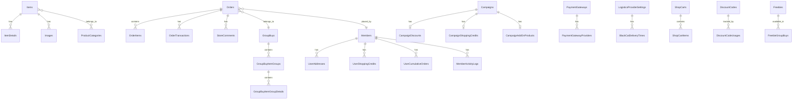
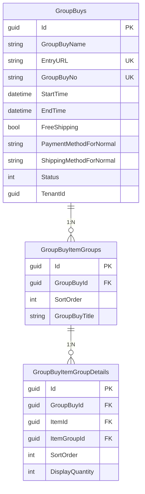
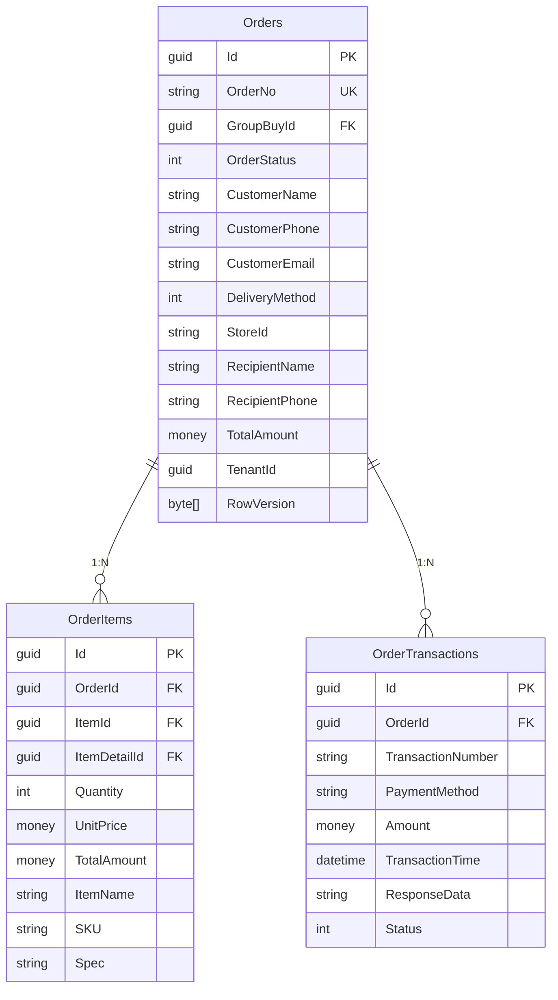
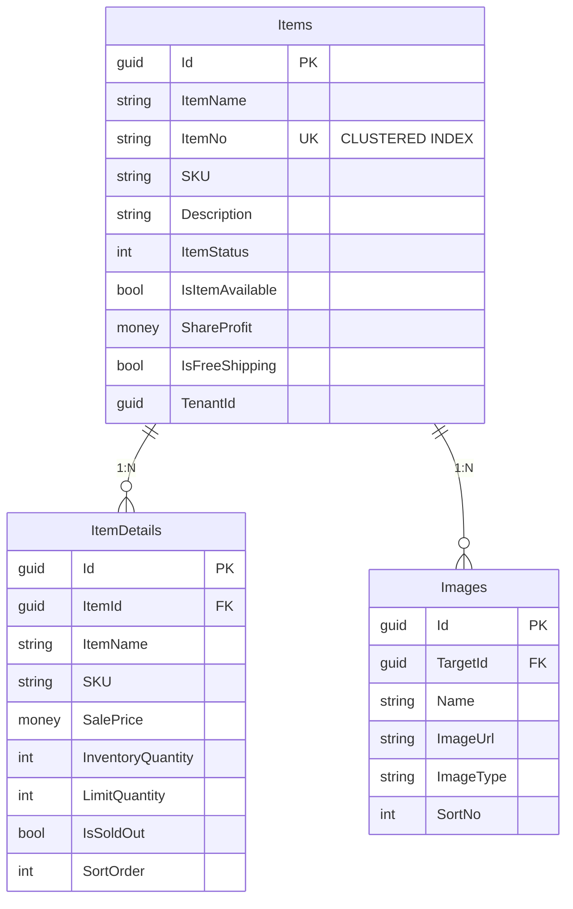

# Pikachu 資料庫設計文檔

## 資料庫概述

Pikachu 電商平台使用 Microsoft SQL Server 作為主要資料庫，採用 Entity Framework Core 9.0 進行資料存取。系統遵循領域驅動設計（DDD）原則，資料庫結構反映了業務領域模型的設計。

### 資料庫規格

- **資料庫類型**: Microsoft SQL Server 2019+ / Azure SQL Database
- **ORM 框架**: Entity Framework Core 9.0.1
- **連線逾時**: 30 秒
- **命令逾時**: 120 秒
- **支援功能**: 多租戶、審計追蹤、軟刪除、樂觀鎖定

### 命名規範

- **資料表**: PascalCase，複數形式（如 `Orders`, `Items`）
- **欄位**: PascalCase（如 `CustomerName`, `CreationTime`）
- **主鍵**: 統一使用 `Id` (GUID)
- **外鍵**: `{相關實體}Id`（如 `GroupBuyId`, `ItemId`）

## 核心資料模型 ER 圖

### 整體架構



### 團購模組



### 訂單模組



### 商品模組



## 主要資料表詳細說明

### 1. 團購相關資料表

#### GroupBuys（團購主表）
| 欄位名稱 | 資料類型 | 說明 | 約束 |
|---------|---------|------|------|
| Id | uniqueidentifier | 主鍵 | PK, NOT NULL |
| GroupBuyName | nvarchar(255) | 團購名稱 | NOT NULL |
| EntryURL | nvarchar(255) | 團購網址 | UNIQUE, NOT NULL |
| GroupBuyNo | nvarchar(50) | 團購編號 | UNIQUE |
| LogoURL | nvarchar(500) | Logo 圖片網址 | |
| BannerURL | nvarchar(500) | 橫幅圖片網址 | |
| StartTime | datetime2 | 開始時間 | NOT NULL |
| EndTime | datetime2 | 結束時間 | NOT NULL |
| FreeShipping | bit | 是否免運 | DEFAULT 0 |
| PaymentMethodForNormal | nvarchar(max) | 常溫商品付款方式 | JSON |
| PaymentMethodForFreeze | nvarchar(max) | 冷凍商品付款方式 | JSON |
| PaymentMethodForFridge | nvarchar(max) | 冷藏商品付款方式 | JSON |
| ShippingMethodForNormal | nvarchar(max) | 常溫商品配送方式 | JSON |
| IsGroupBuyAvailable | bit | 是否啟用 | DEFAULT 1 |
| Status | int | 團購狀態 | 0:草稿 1:進行中 2:已結束 |
| TenantId | uniqueidentifier | 租戶ID | FK |
| CreationTime | datetime2 | 建立時間 | NOT NULL |
| CreatorId | uniqueidentifier | 建立者 | FK |
| LastModificationTime | datetime2 | 最後修改時間 | |
| LastModifierId | uniqueidentifier | 最後修改者 | FK |
| IsDeleted | bit | 是否刪除 | DEFAULT 0 |
| DeletionTime | datetime2 | 刪除時間 | |
| DeleterId | uniqueidentifier | 刪除者 | FK |

### 2. 訂單相關資料表

#### Orders（訂單主表）
| 欄位名稱 | 資料類型 | 說明 | 約束 |
|---------|---------|------|------|
| Id | uniqueidentifier | 主鍵 | PK, NOT NULL |
| OrderNo | nvarchar(50) | 訂單編號 | UNIQUE, NOT NULL |
| GroupBuyId | uniqueidentifier | 團購ID | FK, NOT NULL |
| OrderType | int | 訂單類型 | 0:一般 1:補單 |
| OrderStatus | int | 訂單狀態 | 見狀態列表 |
| CustomerName | nvarchar(100) | 客戶姓名 | NOT NULL |
| CustomerPhone | nvarchar(20) | 客戶電話 | NOT NULL |
| CustomerEmail | nvarchar(255) | 客戶Email | |
| DeliveryMethod | int | 配送方式 | 見配送方式列表 |
| PaymentMethod | nvarchar(50) | 付款方式 | |
| RecipientName | nvarchar(100) | 收件人姓名 | NOT NULL |
| RecipientPhone | nvarchar(20) | 收件人電話 | NOT NULL |
| RecipientAddress | nvarchar(500) | 收件地址 | |
| StoreId | nvarchar(20) | 超商店號 | |
| StoreName | nvarchar(100) | 超商店名 | |
| TotalQuantity | int | 總數量 | DEFAULT 0 |
| TotalAmount | money | 總金額 | DEFAULT 0 |
| ItemsAmount | money | 商品金額 | DEFAULT 0 |
| ShippingFee | money | 運費 | DEFAULT 0 |
| RowVersion | rowversion | 版本控制 | 樂觀鎖定 |
| TenantId | uniqueidentifier | 租戶ID | FK |

**訂單狀態列表**：
- 0: Unpaid（未付款）
- 1: Paid（已付款）
- 2: Processing（處理中）
- 3: Shipped（已出貨）
- 4: Completed（已完成）
- 5: Cancelled（已取消）
- 6: Returned（已退貨）
- 7: Refunded（已退款）

**配送方式列表**：
- 0: SelfPickup（自取）
- 1: HomeDelivery（宅配）
- 2: SevenEleven（7-11）
- 3: FamilyMart（全家）
- 4: BlackCat（黑貓）
- 5: PostOffice（郵局）

### 3. 商品相關資料表

#### Items（商品主表）
| 欄位名稱 | 資料類型 | 說明 | 約束 |
|---------|---------|------|------|
| Id | uniqueidentifier | 主鍵 | PK, NOT NULL |
| ItemName | nvarchar(255) | 商品名稱 | NOT NULL |
| ItemNo | nvarchar(50) | 商品編號 | UNIQUE, CLUSTERED INDEX |
| SKU | nvarchar(100) | SKU | |
| Description | nvarchar(max) | 商品描述 | |
| DescriptionDetails | nvarchar(max) | 詳細描述 | HTML |
| ItemStatus | int | 商品狀態 | 0:草稿 1:上架 2:下架 |
| IsItemAvailable | bit | 是否可用 | DEFAULT 1 |
| ShareProfit | money | 分潤金額 | DEFAULT 0 |
| IsFreeShipping | bit | 是否免運 | DEFAULT 0 |
| IsReturnable | bit | 是否可退貨 | DEFAULT 1 |
| ShippingMethodForNormal | nvarchar(max) | 常溫配送方式 | JSON |
| ShippingMethodForFreeze | nvarchar(max) | 冷凍配送方式 | JSON |
| ShippingMethodForFridge | nvarchar(max) | 冷藏配送方式 | JSON |
| CustomField1-10 | nvarchar(500) | 自定義欄位 | |
| TenantId | uniqueidentifier | 租戶ID | FK |

#### ItemDetails（商品規格表）
| 欄位名稱 | 資料類型 | 說明 | 約束 |
|---------|---------|------|------|
| Id | uniqueidentifier | 主鍵 | PK, NOT NULL |
| ItemId | uniqueidentifier | 商品ID | FK, NOT NULL |
| ItemName | nvarchar(255) | 規格名稱 | |
| SKU | nvarchar(100) | 規格SKU | |
| Spec | nvarchar(500) | 規格說明 | |
| SalePrice | money | 售價 | NOT NULL |
| ListPrice | money | 定價 | |
| InventoryQuantity | int | 庫存數量 | DEFAULT 0 |
| LimitQuantity | int | 限購數量 | |
| IsSoldOut | bit | 是否售完 | DEFAULT 0 |
| SortOrder | int | 排序 | DEFAULT 0 |

### 4. 會員相關資料表

#### Members（會員主表）
| 欄位名稱 | 資料類型 | 說明 | 約束 |
|---------|---------|------|------|
| Id | uniqueidentifier | 主鍵 | PK, NOT NULL |
| Name | nvarchar(100) | 會員姓名 | NOT NULL |
| PhoneNumber | nvarchar(20) | 手機號碼 | UNIQUE, NOT NULL |
| Email | nvarchar(255) | Email | UNIQUE |
| Birthday | date | 生日 | |
| MemberLevel | int | 會員等級 | DEFAULT 0 |
| TotalPoints | int | 總積分 | DEFAULT 0 |
| ShoppingCredits | money | 購物金餘額 | DEFAULT 0 |
| IsBlackList | bit | 是否黑名單 | DEFAULT 0 |
| LastLoginTime | datetime2 | 最後登入時間 | |
| TenantId | uniqueidentifier | 租戶ID | FK |

### 5. 支付與物流資料表

#### PaymentGateways（支付網關設定）
| 欄位名稱 | 資料類型 | 說明 | 約束 |
|---------|---------|------|------|
| Id | uniqueidentifier | 主鍵 | PK, NOT NULL |
| PaymentMethod | nvarchar(50) | 支付方式 | NOT NULL |
| IsEnabled | bit | 是否啟用 | DEFAULT 1 |
| Configuration | nvarchar(max) | 設定資料 | JSON |
| TenantId | uniqueidentifier | 租戶ID | FK |

#### LogisticsProviderSettings（物流商設定）
| 欄位名稱 | 資料類型 | 說明 | 約束 |
|---------|---------|------|------|
| Id | uniqueidentifier | 主鍵 | PK, NOT NULL |
| LogisticsProvider | nvarchar(50) | 物流商 | NOT NULL |
| IsEnabled | bit | 是否啟用 | DEFAULT 1 |
| Configuration | nvarchar(max) | 設定資料 | JSON |
| TenantId | uniqueidentifier | 租戶ID | FK |

## 索引設計

### 效能優化索引

1. **Items 表**
   - CLUSTERED INDEX: `ItemNo`（商品編號）
   - NONCLUSTERED INDEX: `ItemStatus, IsItemAvailable`（查詢可用商品）
   - NONCLUSTERED INDEX: `TenantId, ItemName`（租戶內搜尋）

2. **Orders 表**
   - NONCLUSTERED INDEX: `OrderNo`（訂單號查詢）
   - NONCLUSTERED INDEX: `GroupBuyId, OrderStatus`（團購訂單查詢）
   - NONCLUSTERED INDEX: `CustomerPhone`（客戶查詢）
   - NONCLUSTERED INDEX: `CreationTime DESC`（最新訂單）

3. **GroupBuys 表**
   - UNIQUE INDEX: `EntryURL`（網址唯一性）
   - NONCLUSTERED INDEX: `StartTime, EndTime, Status`（進行中團購）
   - NONCLUSTERED INDEX: `TenantId, Status`（租戶團購查詢）

4. **Members 表**
   - UNIQUE INDEX: `PhoneNumber`（手機號唯一性）
   - UNIQUE INDEX: `Email`（Email 唯一性）
   - NONCLUSTERED INDEX: `TenantId, MemberLevel`（會員等級查詢）

### 外鍵索引

所有外鍵欄位都自動建立索引以優化 JOIN 效能。

## 資料庫特殊功能

### 1. 多租戶設計

大部分資料表都包含 `TenantId` 欄位，實現資料隔離：

```sql
-- 查詢時自動加入租戶過濾
SELECT * FROM Orders WHERE TenantId = @CurrentTenantId
```

### 2. 審計追蹤

使用 ABP 框架的審計功能，自動追蹤：
- `CreationTime` - 建立時間
- `CreatorId` - 建立者
- `LastModificationTime` - 最後修改時間
- `LastModifierId` - 最後修改者

### 3. 軟刪除

支援軟刪除功能：
- `IsDeleted` - 是否刪除
- `DeletionTime` - 刪除時間
- `DeleterId` - 刪除者

```sql
-- 查詢時自動過濾已刪除資料
SELECT * FROM Items WHERE IsDeleted = 0
```

### 4. 樂觀鎖定

Orders 表使用 `RowVersion` 實現樂觀鎖定：

```sql
UPDATE Orders 
SET OrderStatus = @NewStatus, 
    RowVersion = DEFAULT 
WHERE Id = @OrderId 
  AND RowVersion = @CurrentRowVersion
```

### 5. JSON 欄位

多個設定欄位使用 JSON 格式儲存：

```sql
-- 查詢支援特定付款方式的團購
SELECT * FROM GroupBuys 
WHERE JSON_VALUE(PaymentMethodForNormal, '$[0]') = 'CreditCard'
```

## 資料遷移策略

### 1. 版本控制

使用 Entity Framework Core Migrations 管理資料庫版本：

```bash
# 新增遷移
dotnet ef migrations add AddNewFeature

# 更新資料庫
dotnet ef database update
```

### 2. 遷移命名規範

- 格式：`{動作}{對象}`
- 範例：`AddShoppingCreditsTable`、`UpdateOrderStatusEnum`

### 3. 資料種子

初始資料透過 `IDataSeedContributor` 介面載入：
- 預設管理員帳號
- 系統設定預設值
- 基礎資料字典

## 效能優化建議

### 1. 查詢優化

- 使用適當的索引
- 避免 N+1 查詢問題
- 使用投影減少資料傳輸

```csharp
// 好的做法
var orders = await _orderRepository
    .AsQueryable()
    .Include(o => o.OrderItems)
    .Where(o => o.GroupBuyId == groupBuyId)
    .Select(o => new OrderDto
    {
        Id = o.Id,
        OrderNo = o.OrderNo,
        TotalAmount = o.TotalAmount
    })
    .ToListAsync();
```

### 2. 批次處理

大量資料操作使用批次處理：

```csharp
// 批次更新庫存
await _context.BulkUpdateAsync(itemDetails);
```

### 3. 快取策略

- 使用 Redis 快取熱門資料
- 商品資訊快取 5 分鐘
- 團購資訊快取 1 分鐘

### 4. 分區策略

大型資料表考慮分區：
- Orders 表按月分區
- OrderItems 表按訂單月份分區
- Logs 表按日分區

## 備份與還原

### 1. 備份策略

- **完整備份**：每週日凌晨 2:00
- **差異備份**：每日凌晨 2:00
- **交易日誌備份**：每小時

### 2. 還原測試

- 每月進行還原演練
- 確保 RTO < 4 小時
- RPO < 1 小時

### 3. 災難復原

- 使用 Azure SQL Database 自動備份
- 啟用異地複寫
- 設定自動容錯移轉群組

## 資料庫維護

### 1. 定期維護任務

```sql
-- 重建索引（每週）
ALTER INDEX ALL ON Orders REBUILD

-- 更新統計資料（每日）
UPDATE STATISTICS Orders WITH FULLSCAN

-- 清理過期資料（每月）
DELETE FROM Logs WHERE CreationTime < DATEADD(MONTH, -3, GETDATE())
```

### 2. 監控指標

- 查詢效能（執行時間 > 1 秒）
- 索引使用率
- 資料表大小增長
- 死結發生頻率

### 3. 效能調校

- 定期檢查執行計畫
- 識別遺失索引
- 優化高頻查詢
- 調整資料庫參數

## 安全性考量

### 1. 存取控制

- 使用最小權限原則
- 應用程式使用專用帳號
- 禁止直接資料庫存取

### 2. 資料加密

- 啟用透明資料加密（TDE）
- 連線使用 SSL/TLS
- 敏感資料欄位加密

### 3. 稽核記錄

- 啟用 SQL Server Audit
- 記錄所有 DDL 操作
- 監控異常存取模式

## 疑難排解

### 1. 常見問題

**連線逾時**
- 檢查連線字串
- 確認網路連通性
- 調整連線逾時設定

**死結問題**
- 檢視死結圖形
- 調整交易隔離等級
- 優化查詢順序

**效能降低**
- 更新統計資料
- 重建索引
- 檢查查詢計畫

### 2. 診斷工具

- SQL Server Profiler
- Extended Events
- Dynamic Management Views (DMVs)
- Query Store

### 3. 緊急處理

```sql
-- 找出阻塞的連線
SELECT * FROM sys.dm_exec_requests WHERE blocking_session_id > 0

-- 終止問題連線
KILL {session_id}

-- 檢查資料庫狀態
DBCC CHECKDB('PikachuDb')
```

## 更新日誌

### v2.0.0 (2024-01-15)
- 新增物流狀態追蹤表
- 優化訂單查詢索引
- 新增庫存異動記錄表

### v1.5.0 (2023-12-01)
- 新增購物金功能相關表
- 優化會員查詢效能
- 新增 VIP 等級設定表

### v1.0.0 (2023-10-01)
- 初始資料庫結構
- 核心電商功能表