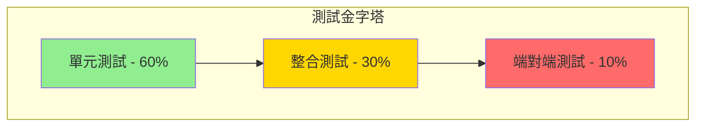

# Pikachu 測試文檔

## 測試策略概述

Pikachu 電商平台採用全面的測試策略，確保系統的可靠性、穩定性和高品質。我們實施多層次的測試方法，從單元測試到整合測試，涵蓋所有關鍵業務流程。

### 測試原則

1. **測試優先**：遵循 TDD（測試驅動開發）原則
2. **自動化測試**：所有測試必須可自動執行
3. **持續整合**：每次提交都執行完整測試套件
4. **測試隔離**：測試之間相互獨立，無依賴關係
5. **真實場景**：測試案例基於實際業務場景

### 測試金字塔



## 測試專案結構

### 專案組織

```
test/
├── Kooco.Pikachu.TestBase/              # 測試基礎設施
│   ├── PikachuTestBase.cs              # 基礎測試類
│   ├── PikachuTestDataSeedContributor.cs # 測試資料種子
│   └── TestData.cs                      # 測試資料常數
├── Kooco.Pikachu.Domain.Tests/          # 領域層測試
│   ├── GroupBuys/                       # 團購領域測試
│   ├── Orders/                          # 訂單領域測試
│   └── Items/                           # 商品領域測試
├── Kooco.Pikachu.Application.Tests/     # 應用層測試
│   ├── GroupBuys/                       # 團購服務測試
│   ├── Orders/                          # 訂單服務測試
│   ├── Items/                           # 商品服務測試
│   └── Members/                         # 會員服務測試
├── Kooco.Pikachu.EntityFrameworkCore.Tests/ # 資料層測試
│   └── Repositories/                    # 倉儲測試
└── Kooco.Pikachu.HttpApi.Client.ConsoleTestApp/ # API 客戶端測試
```

### 測試基礎設施

#### PikachuTestBase 基類

```csharp
public abstract class PikachuTestBase<TStartupModule> : AbpIntegratedTest<TStartupModule>
    where TStartupModule : IAbpModule
{
    protected override void SetAbpApplicationCreationOptions(AbpApplicationCreationOptions options)
    {
        options.UseAutofac();
    }

    protected virtual async Task WithUnitOfWorkAsync(Func<Task> action)
    {
        using (var scope = ServiceProvider.CreateScope())
        {
            var unitOfWorkManager = scope.ServiceProvider.GetRequiredService<IUnitOfWorkManager>();
            using (var uow = unitOfWorkManager.Begin())
            {
                await action();
                await uow.CompleteAsync();
            }
        }
    }

    protected virtual T GetRequiredService<T>()
    {
        return ServiceProvider.GetRequiredService<T>();
    }
}
```

#### 測試資料種子

```csharp
public class PikachuTestDataSeedContributor : IDataSeedContributor, ITransientDependency
{
    private readonly IGroupBuyRepository _groupBuyRepository;
    private readonly IItemRepository _itemRepository;
    private readonly IGuidGenerator _guidGenerator;

    public async Task SeedAsync(DataSeedContext context)
    {
        // 建立測試團購
        var testGroupBuy = new GroupBuy(
            _guidGenerator.Create(),
            "Test Group Buy",
            "test-group-buy",
            "GB-TEST-001"
        );
        await _groupBuyRepository.InsertAsync(testGroupBuy);

        // 建立測試商品
        var testItem = new Item(
            _guidGenerator.Create(),
            "Test Product",
            "ITEM-TEST-001"
        );
        await _itemRepository.InsertAsync(testItem);
    }
}
```

## 單元測試 (Unit Tests)

### 領域層測試

#### 團購實體測試

```csharp
public class GroupBuy_Tests : PikachuDomainTestBase
{
    private readonly IGuidGenerator _guidGenerator;

    public GroupBuy_Tests()
    {
        _guidGenerator = GetRequiredService<IGuidGenerator>();
    }

    [Fact]
    public void Should_Create_GroupBuy_With_Valid_Data()
    {
        // Arrange
        var id = _guidGenerator.Create();
        var name = "春季團購";
        var entryUrl = "spring-2024";
        var groupBuyNo = "GB202401001";

        // Act
        var groupBuy = new GroupBuy(id, name, entryUrl, groupBuyNo);

        // Assert
        groupBuy.ShouldNotBeNull();
        groupBuy.Id.ShouldBe(id);
        groupBuy.GroupBuyName.ShouldBe(name);
        groupBuy.EntryURL.ShouldBe(entryUrl);
        groupBuy.GroupBuyNo.ShouldBe(groupBuyNo);
        groupBuy.Status.ShouldBe(GroupBuyStatus.Draft);
    }

    [Fact]
    public void Should_Not_Create_GroupBuy_With_Empty_Name()
    {
        // Arrange & Act & Assert
        Should.Throw<ArgumentException>(() =>
            new GroupBuy(_guidGenerator.Create(), "", "url", "no")
        );
    }

    [Fact]
    public void Should_Activate_GroupBuy_When_Valid()
    {
        // Arrange
        var groupBuy = new GroupBuy(
            _guidGenerator.Create(),
            "Test Group Buy",
            "test-url",
            "GB-TEST"
        );
        groupBuy.SetTimeRange(
            DateTime.Now.AddDays(-1),
            DateTime.Now.AddDays(7)
        );

        // Act
        groupBuy.Activate();

        // Assert
        groupBuy.Status.ShouldBe(GroupBuyStatus.Active);
    }

    [Fact]
    public void Should_Not_Activate_GroupBuy_Without_TimeRange()
    {
        // Arrange
        var groupBuy = new GroupBuy(
            _guidGenerator.Create(),
            "Test Group Buy",
            "test-url",
            "GB-TEST"
        );

        // Act & Assert
        Should.Throw<BusinessException>(() => groupBuy.Activate())
            .Code.ShouldBe("Pikachu:GroupBuyTimeRangeNotSet");
    }
}
```

#### 訂單領域服務測試

```csharp
public class OrderManager_Tests : PikachuDomainTestBase
{
    private readonly OrderManager _orderManager;
    private readonly IItemRepository _itemRepository;

    public OrderManager_Tests()
    {
        _orderManager = GetRequiredService<OrderManager>();
        _itemRepository = GetRequiredService<IItemRepository>();
    }

    [Fact]
    public async Task Should_Calculate_Order_Total_Correctly()
    {
        // Arrange
        var order = new Order();
        var items = new List<CreateOrderItemDto>
        {
            new() { ItemId = TestData.Item1Id, Quantity = 2, UnitPrice = 100 },
            new() { ItemId = TestData.Item2Id, Quantity = 1, UnitPrice = 200 }
        };

        // Act
        await _orderManager.AddOrderItemsAsync(order, items);

        // Assert
        order.TotalAmount.ShouldBe(400); // (2*100) + (1*200)
        order.OrderItems.Count.ShouldBe(2);
    }

    [Fact]
    public async Task Should_Apply_FreeShipping_When_Amount_Exceeds_Threshold()
    {
        // Arrange
        var order = new Order();
        order.ItemsAmount = 1000;
        order.ShippingFee = 60;

        // Act
        await _orderManager.ApplyFreeShippingAsync(order, 800);

        // Assert
        order.ShippingFee.ShouldBe(0);
        order.TotalAmount.ShouldBe(1000);
    }

    [Fact]
    public async Task Should_Check_Inventory_Before_Order()
    {
        // Arrange
        var item = await _itemRepository.GetAsync(TestData.Item1Id);
        var itemDetail = item.ItemDetails.First();
        itemDetail.SetInventory(5);

        // Act & Assert
        Should.Throw<BusinessException>(async () =>
            await _orderManager.CheckInventoryAsync(item.Id, itemDetail.Id, 10)
        ).Code.ShouldBe("Pikachu:InsufficientInventory");
    }
}
```

### 應用層測試

#### 團購應用服務測試

```csharp
public class GroupBuyAppService_Tests : PikachuApplicationTestBase
{
    private readonly IGroupBuyAppService _groupBuyAppService;

    public GroupBuyAppService_Tests()
    {
        _groupBuyAppService = GetRequiredService<IGroupBuyAppService>();
    }

    [Fact]
    public async Task Should_Get_GroupBuy_List()
    {
        // Act
        var result = await _groupBuyAppService.GetListAsync(
            new PagedAndSortedResultRequestDto
            {
                MaxResultCount = 10,
                SkipCount = 0
            }
        );

        // Assert
        result.TotalCount.ShouldBeGreaterThan(0);
        result.Items.ShouldNotBeEmpty();
    }

    [Fact]
    public async Task Should_Create_GroupBuy()
    {
        // Arrange
        var input = new CreateGroupBuyDto
        {
            GroupBuyName = "Test Group Buy",
            EntryURL = "test-gb-" + Guid.NewGuid().ToString("N"),
            GroupBuyNo = "GB-" + DateTime.Now.Ticks,
            StartTime = DateTime.Now,
            EndTime = DateTime.Now.AddDays(7)
        };

        // Act
        var result = await _groupBuyAppService.CreateAsync(input);

        // Assert
        result.ShouldNotBeNull();
        result.GroupBuyName.ShouldBe(input.GroupBuyName);
        result.Status.ShouldBe(GroupBuyStatus.Draft);
    }

    [Fact]
    public async Task Should_Not_Create_Duplicate_GroupBuy()
    {
        // Arrange
        var entryUrl = "duplicate-test";
        await _groupBuyAppService.CreateAsync(new CreateGroupBuyDto
        {
            GroupBuyName = "First",
            EntryURL = entryUrl,
            StartTime = DateTime.Now,
            EndTime = DateTime.Now.AddDays(7)
        });

        // Act & Assert
        await Should.ThrowAsync<BusinessException>(async () =>
            await _groupBuyAppService.CreateAsync(new CreateGroupBuyDto
            {
                GroupBuyName = "Second",
                EntryURL = entryUrl,
                StartTime = DateTime.Now,
                EndTime = DateTime.Now.AddDays(7)
            })
        );
    }

    [Fact]
    public async Task Should_Generate_GroupBuy_Report()
    {
        // Arrange
        var groupBuyId = TestData.GroupBuy1Id;

        // Act
        var report = await _groupBuyAppService.GetGroupBuyReportAsync(groupBuyId);

        // Assert
        report.ShouldNotBeNull();
        report.GroupBuyId.ShouldBe(groupBuyId);
        report.Summary.ShouldNotBeNull();
        report.ItemSales.ShouldNotBeNull();
    }
}
```

#### 訂單應用服務測試

```csharp
public class OrderAppService_Tests : PikachuApplicationTestBase
{
    private readonly IOrderAppService _orderAppService;
    private readonly IRepository<Item, Guid> _itemRepository;

    public OrderAppService_Tests()
    {
        _orderAppService = GetRequiredService<IOrderAppService>();
        _itemRepository = GetRequiredService<IRepository<Item, Guid>>();
    }

    [Fact]
    public async Task Should_Create_Order_Successfully()
    {
        // Arrange
        var input = new CreateOrderDto
        {
            GroupBuyId = TestData.GroupBuy1Id,
            CustomerName = "測試客戶",
            CustomerPhone = "0912345678",
            CustomerEmail = "test@example.com",
            DeliveryMethod = DeliveryMethod.SevenEleven,
            StoreId = "123456",
            PaymentMethod = "CreditCard",
            Items = new List<CreateOrderItemDto>
            {
                new()
                {
                    ItemId = TestData.Item1Id,
                    ItemDetailId = TestData.ItemDetail1Id,
                    Quantity = 2,
                    UnitPrice = 500
                }
            },
            RecipientName = "收件人",
            RecipientPhone = "0912345678"
        };

        // Act
        var result = await _orderAppService.CreateAsync(input);

        // Assert
        result.ShouldNotBeNull();
        result.OrderNo.ShouldNotBeNullOrWhiteSpace();
        result.TotalAmount.ShouldBe(1000);
        result.Status.ShouldBe(OrderStatus.Unpaid);
    }

    [Fact]
    public async Task Should_Update_Order_Status_After_Payment()
    {
        // Arrange
        var order = await CreateTestOrderAsync();
        var paymentCallback = new PaymentCallbackDto
        {
            OrderNo = order.OrderNo,
            TransactionNo = "PAY" + DateTime.Now.Ticks,
            PaymentMethod = "CreditCard",
            Amount = order.TotalAmount,
            Status = PaymentStatus.Success
        };

        // Act
        await _orderAppService.ProcessPaymentCallbackAsync(paymentCallback);

        // Assert
        var updatedOrder = await _orderAppService.GetAsync(order.Id);
        updatedOrder.Status.ShouldBe(OrderStatus.Paid);
    }

    [Fact]
    public async Task Should_Ship_Order()
    {
        // Arrange
        var order = await CreatePaidOrderAsync();
        var shipInput = new ShipOrderDto
        {
            OrderId = order.Id,
            ShippingNumber = "SHIP123456789",
            ShippingDate = DateTime.Now,
            LogisticsProvider = "BlackCat"
        };

        // Act
        await _orderAppService.ShipOrderAsync(shipInput);

        // Assert
        var shippedOrder = await _orderAppService.GetAsync(order.Id);
        shippedOrder.Status.ShouldBe(OrderStatus.Shipped);
        shippedOrder.ShippingNumber.ShouldBe(shipInput.ShippingNumber);
    }

    private async Task<OrderDto> CreateTestOrderAsync()
    {
        // 建立測試訂單的輔助方法
        var input = new CreateOrderDto { /* ... */ };
        return await _orderAppService.CreateAsync(input);
    }

    private async Task<OrderDto> CreatePaidOrderAsync()
    {
        var order = await CreateTestOrderAsync();
        // 模擬付款
        await _orderAppService.ProcessPaymentCallbackAsync(new PaymentCallbackDto
        {
            OrderNo = order.OrderNo,
            Status = PaymentStatus.Success
        });
        return await _orderAppService.GetAsync(order.Id);
    }
}
```

## 整合測試 (Integration Tests)

### 資料庫整合測試

```csharp
public class OrderRepository_Tests : PikachuEntityFrameworkCoreTestBase
{
    private readonly IOrderRepository _orderRepository;
    private readonly IUnitOfWorkManager _unitOfWorkManager;

    public OrderRepository_Tests()
    {
        _orderRepository = GetRequiredService<IOrderRepository>();
        _unitOfWorkManager = GetRequiredService<IUnitOfWorkManager>();
    }

    [Fact]
    public async Task Should_Query_Orders_By_GroupBuy()
    {
        // Arrange
        var groupBuyId = TestData.GroupBuy1Id;

        // Act
        var orders = await _orderRepository.GetListByGroupBuyAsync(groupBuyId);

        // Assert
        orders.ShouldNotBeNull();
        orders.ShouldAllBe(o => o.GroupBuyId == groupBuyId);
    }

    [Fact]
    public async Task Should_Update_Order_With_Optimistic_Locking()
    {
        // Arrange
        using var uow = _unitOfWorkManager.Begin();
        var order = await _orderRepository.GetAsync(TestData.Order1Id);
        var originalVersion = order.RowVersion;

        // Act
        order.SetStatus(OrderStatus.Processing);
        await _orderRepository.UpdateAsync(order);
        await uow.CompleteAsync();

        // Assert
        order.RowVersion.ShouldNotBe(originalVersion);
    }

    [Fact]
    public async Task Should_Include_Related_Entities()
    {
        // Act
        var query = await _orderRepository.WithDetailsAsync();
        var order = await query.FirstOrDefaultAsync(o => o.Id == TestData.Order1Id);

        // Assert
        order.ShouldNotBeNull();
        order.OrderItems.ShouldNotBeEmpty();
        order.OrderItems.First().Item.ShouldNotBeNull();
    }
}
```

### API 整合測試

```csharp
public class OrderController_IntegrationTests : PikachuWebTestBase
{
    private readonly IOrderAppService _orderAppService;

    [Fact]
    public async Task Should_Get_Orders_Via_API()
    {
        // Arrange
        var client = GetHttpClient();

        // Act
        var response = await client.GetAsync("/api/app/orders");
        response.EnsureSuccessStatusCode();

        var content = await response.Content.ReadAsStringAsync();
        var result = JsonSerializer.Deserialize<PagedResultDto<OrderDto>>(content);

        // Assert
        result.ShouldNotBeNull();
        result.Items.ShouldNotBeNull();
    }

    [Fact]
    public async Task Should_Create_Order_Via_API()
    {
        // Arrange
        var client = GetHttpClient();
        var input = new CreateOrderDto
        {
            GroupBuyId = TestData.GroupBuy1Id,
            CustomerName = "API Test Customer",
            CustomerPhone = "0911111111",
            Items = new List<CreateOrderItemDto>
            {
                new() { ItemId = TestData.Item1Id, Quantity = 1, UnitPrice = 100 }
            }
        };

        // Act
        var response = await client.PostAsJsonAsync("/api/app/orders", input);
        response.EnsureSuccessStatusCode();

        var content = await response.Content.ReadAsStringAsync();
        var result = JsonSerializer.Deserialize<OrderDto>(content);

        // Assert
        result.ShouldNotBeNull();
        result.OrderNo.ShouldNotBeNullOrWhiteSpace();
    }

    [Fact]
    public async Task Should_Handle_Payment_Callback()
    {
        // Arrange
        var client = GetHttpClient();
        var formData = new FormUrlEncodedContent(new[]
        {
            new KeyValuePair<string, string>("MerchantTradeNo", "ORD202401150001"),
            new KeyValuePair<string, string>("RtnCode", "1"),
            new KeyValuePair<string, string>("RtnMsg", "交易成功"),
            new KeyValuePair<string, string>("TradeAmt", "1000"),
            new KeyValuePair<string, string>("CheckMacValue", "VALID_MAC")
        });

        // Act
        var response = await client.PostAsync("/api/app/orders/callback", formData);

        // Assert
        response.StatusCode.ShouldBe(HttpStatusCode.OK);
    }
}
```

## 測試資料準備

### 測試常數定義

```csharp
public static class TestData
{
    // 團購測試資料
    public static readonly Guid GroupBuy1Id = Guid.Parse("11111111-1111-1111-1111-111111111111");
    public static readonly Guid GroupBuy2Id = Guid.Parse("22222222-2222-2222-2222-222222222222");
    
    // 商品測試資料
    public static readonly Guid Item1Id = Guid.Parse("33333333-3333-3333-3333-333333333333");
    public static readonly Guid Item2Id = Guid.Parse("44444444-4444-4444-4444-444444444444");
    public static readonly Guid ItemDetail1Id = Guid.Parse("55555555-5555-5555-5555-555555555555");
    
    // 訂單測試資料
    public static readonly Guid Order1Id = Guid.Parse("66666666-6666-6666-6666-666666666666");
    
    // 會員測試資料
    public static readonly Guid Member1Id = Guid.Parse("77777777-7777-7777-7777-777777777777");
    
    // 測試用戶資料
    public const string TestUserName = "test";
    public const string TestUserEmail = "test@pikachu.com";
    public const string TestUserPassword = "Test123!";
}
```

### 測試資料建構器

```csharp
public class TestDataBuilder
{
    private readonly IGuidGenerator _guidGenerator;
    private readonly IRepository<GroupBuy, Guid> _groupBuyRepository;
    private readonly IRepository<Item, Guid> _itemRepository;

    public async Task<GroupBuy> CreateGroupBuyAsync(
        string name = null,
        DateTime? startTime = null,
        DateTime? endTime = null)
    {
        var groupBuy = new GroupBuy(
            _guidGenerator.Create(),
            name ?? $"Test Group Buy {Guid.NewGuid():N}",
            $"test-gb-{Guid.NewGuid():N}",
            $"GB{DateTime.Now.Ticks}"
        );

        groupBuy.SetTimeRange(
            startTime ?? DateTime.Now,
            endTime ?? DateTime.Now.AddDays(7)
        );

        return await _groupBuyRepository.InsertAsync(groupBuy);
    }

    public async Task<Item> CreateItemWithDetailsAsync(
        string name = null,
        int detailCount = 1)
    {
        var item = new Item(
            _guidGenerator.Create(),
            name ?? $"Test Item {Guid.NewGuid():N}",
            $"ITEM{DateTime.Now.Ticks}"
        );

        for (int i = 0; i < detailCount; i++)
        {
            item.AddDetail(new ItemDetail(
                _guidGenerator.Create(),
                $"規格 {i + 1}",
                100 * (i + 1),
                100
            ));
        }

        return await _itemRepository.InsertAsync(item);
    }
}
```

## 測試執行與覆蓋率

### 執行測試

```bash
# 執行所有測試
dotnet test

# 執行特定專案的測試
dotnet test test/Kooco.Pikachu.Application.Tests

# 執行特定類別的測試
dotnet test --filter "FullyQualifiedName~OrderAppService_Tests"

# 執行特定測試方法
dotnet test --filter "FullyQualifiedName~Should_Create_Order_Successfully"

# 平行執行測試
dotnet test --parallel

# 產生測試報告
dotnet test --logger "trx;LogFileName=test-results.trx"
```

### 測試覆蓋率

#### 覆蓋率要求

- **整體覆蓋率**: >= 80%
- **關鍵業務邏輯**: >= 90%
- **領域層**: >= 85%
- **應用層**: >= 80%
- **API 層**: >= 70%

#### 產生覆蓋率報告

```bash
# 安裝覆蓋率工具
dotnet tool install --global coverlet.console
dotnet tool install --global dotnet-reportgenerator-globaltool

# 執行測試並收集覆蓋率
coverlet test/Kooco.Pikachu.Application.Tests/bin/Debug/net9.0/Kooco.Pikachu.Application.Tests.dll \
  --target "dotnet" \
  --targetargs "test test/Kooco.Pikachu.Application.Tests --no-build" \
  --format opencover \
  --output coverage.xml

# 產生 HTML 報告
reportgenerator \
  -reports:coverage.xml \
  -targetdir:coveragereport \
  -reporttypes:Html
```

#### 覆蓋率排除規則

```xml
<!-- 在專案檔中配置覆蓋率排除 -->
<PropertyGroup>
  <ExcludeFromCodeCoverage>
    <!-- 排除自動產生的程式碼 -->
    **/*.Designer.cs
    <!-- 排除 Migrations -->
    **/Migrations/**
    <!-- 排除 DbContext -->
    **/*DbContext.cs
  </ExcludeFromCodeCoverage>
</PropertyGroup>
```

## 效能測試

### 負載測試

```csharp
[Collection("Performance")]
public class OrderService_PerformanceTests
{
    [Fact]
    public async Task Should_Handle_Concurrent_Orders()
    {
        // Arrange
        var tasks = new List<Task<OrderDto>>();
        var orderService = GetRequiredService<IOrderAppService>();

        // Act
        for (int i = 0; i < 100; i++)
        {
            tasks.Add(CreateOrderAsync(orderService));
        }

        var results = await Task.WhenAll(tasks);

        // Assert
        results.Length.ShouldBe(100);
        results.ShouldAllBe(r => r != null && !string.IsNullOrEmpty(r.OrderNo));
    }

    [Fact]
    public async Task Should_Complete_Large_Query_Within_Timeout()
    {
        // Arrange
        var stopwatch = Stopwatch.StartNew();
        var orderService = GetRequiredService<IOrderAppService>();

        // Act
        var result = await orderService.GetListAsync(new PagedAndSortedResultRequestDto
        {
            MaxResultCount = 1000,
            SkipCount = 0
        });

        stopwatch.Stop();

        // Assert
        stopwatch.ElapsedMilliseconds.ShouldBeLessThan(3000); // 3 秒內完成
    }
}
```

### 壓力測試腳本

```csharp
public class StressTest
{
    private readonly HttpClient _httpClient;
    private readonly string _baseUrl = "https://localhost:5001";

    [Fact]
    public async Task Stress_Test_Order_Creation()
    {
        var concurrentUsers = 50;
        var requestsPerUser = 20;
        var allTasks = new List<Task>();

        for (int user = 0; user < concurrentUsers; user++)
        {
            var userTask = Task.Run(async () =>
            {
                for (int request = 0; request < requestsPerUser; request++)
                {
                    await CreateOrderViaApi();
                }
            });
            allTasks.Add(userTask);
        }

        var stopwatch = Stopwatch.StartNew();
        await Task.WhenAll(allTasks);
        stopwatch.Stop();

        Console.WriteLine($"Total requests: {concurrentUsers * requestsPerUser}");
        Console.WriteLine($"Total time: {stopwatch.ElapsedMilliseconds} ms");
        Console.WriteLine($"Requests per second: {(concurrentUsers * requestsPerUser * 1000.0) / stopwatch.ElapsedMilliseconds:F2}");
    }
}
```

## 測試最佳實踐

### 1. 測試命名規範

```csharp
// 格式：Should_預期結果_When_條件
[Fact]
public void Should_ThrowException_When_NameIsEmpty() { }

[Fact]
public void Should_ReturnTrue_When_OrderIsValid() { }

[Fact]
public async Task Should_CreateOrder_When_AllDataIsValid() { }
```

### 2. AAA 模式

```csharp
[Fact]
public async Task Should_Calculate_Discount_Correctly()
{
    // Arrange - 準備測試資料
    var order = CreateTestOrder();
    var discountCode = "SAVE10";
    var discountService = GetRequiredService<IDiscountService>();

    // Act - 執行測試動作
    var discount = await discountService.CalculateDiscountAsync(order, discountCode);

    // Assert - 驗證結果
    discount.ShouldBe(100); // 10% of 1000
}
```

### 3. 測試隔離

```csharp
public class OrderServiceTests : IAsyncLifetime
{
    private readonly IServiceScope _scope;
    private readonly IOrderAppService _orderService;

    public OrderServiceTests()
    {
        _scope = ServiceProvider.CreateScope();
        _orderService = _scope.ServiceProvider.GetRequiredService<IOrderAppService>();
    }

    public async Task InitializeAsync()
    {
        // 每個測試前的設置
        await CleanupTestDataAsync();
    }

    public async Task DisposeAsync()
    {
        // 每個測試後的清理
        _scope?.Dispose();
    }
}
```

### 4. Mock 使用

```csharp
[Fact]
public async Task Should_Send_Email_After_Order_Created()
{
    // Arrange
    var emailSenderMock = new Mock<IEmailSender>();
    var orderService = new OrderAppService(emailSenderMock.Object);

    // Act
    await orderService.CreateAsync(new CreateOrderDto());

    // Assert
    emailSenderMock.Verify(
        x => x.SendAsync(It.IsAny<string>(), It.IsAny<string>(), It.IsAny<string>()),
        Times.Once
    );
}
```

### 5. 參數化測試

```csharp
[Theory]
[InlineData(100, 0, 100)]    // 無折扣
[InlineData(1000, 100, 900)] // 滿千折百
[InlineData(500, 50, 450)]   // 9折
public void Should_Calculate_Final_Price(decimal originalPrice, decimal discount, decimal expectedPrice)
{
    // Arrange
    var priceCalculator = new PriceCalculator();

    // Act
    var finalPrice = priceCalculator.Calculate(originalPrice, discount);

    // Assert
    finalPrice.ShouldBe(expectedPrice);
}
```

## 持續整合設定

### GitHub Actions 設定

```yaml
name: Build and Test

on:
  push:
    branches: [ main, develop ]
  pull_request:
    branches: [ main ]

jobs:
  test:
    runs-on: ubuntu-latest
    
    services:
      sqlserver:
        image: mcr.microsoft.com/mssql/server:2019-latest
        env:
          ACCEPT_EULA: Y
          SA_PASSWORD: YourStrong@Passw0rd
        ports:
          - 1433:1433
        options: >-
          --health-cmd "/opt/mssql-tools/bin/sqlcmd -S localhost -U sa -P YourStrong@Passw0rd -Q 'SELECT 1'"
          --health-interval 10s
          --health-timeout 5s
          --health-retries 5

    steps:
    - uses: actions/checkout@v3
    
    - name: Setup .NET
      uses: actions/setup-dotnet@v3
      with:
        dotnet-version: 9.0.x
        
    - name: Restore dependencies
      run: dotnet restore
      
    - name: Build
      run: dotnet build --no-restore
      
    - name: Test
      run: dotnet test --no-build --verbosity normal --collect:"XPlat Code Coverage"
      
    - name: Upload coverage reports
      uses: codecov/codecov-action@v3
      with:
        file: ./coverage.cobertura.xml
        fail_ci_if_error: true
```

### 測試報告通知

```yaml
- name: Test Report
  uses: dorny/test-reporter@v1
  if: success() || failure()
  with:
    name: Test Results
    path: '**/*.trx'
    reporter: dotnet-trx
    
- name: Comment PR
  uses: actions/github-script@v6
  if: github.event_name == 'pull_request'
  with:
    script: |
      github.rest.issues.createComment({
        issue_number: context.issue.number,
        owner: context.repo.owner,
        repo: context.repo.repo,
        body: '✅ All tests passed! Coverage: 85.3%'
      })
```

## 疑難排解

### 常見測試問題

1. **資料庫連線失敗**
   ```csharp
   // 確保測試使用記憶體資料庫
   Configure<AbpDbContextOptions>(options =>
   {
       options.Configure(context =>
       {
           context.DbContextOptions.UseInMemoryDatabase("TestDb");
       });
   });
   ```

2. **測試間相互影響**
   ```csharp
   // 使用獨立的資料庫實例
   var dbName = $"TestDb_{Guid.NewGuid():N}";
   ```

3. **非同步測試逾時**
   ```csharp
   [Fact(Timeout = 5000)] // 5 秒逾時
   public async Task Should_Complete_Within_Timeout()
   {
       // 測試程式碼
   }
   ```

### 除錯技巧

1. **輸出測試日誌**
   ```csharp
   public class TestWithLogging : PikachuTestBase
   {
       private readonly ITestOutputHelper _output;

       public TestWithLogging(ITestOutputHelper output)
       {
           _output = output;
       }

       [Fact]
       public void Test_With_Logging()
       {
           _output.WriteLine("Debug information");
       }
   }
   ```

2. **測試中斷點**
   - 在 Visual Studio 中設定中斷點
   - 使用 Test Explorer 的 Debug 功能

3. **測試隔離執行**
   ```bash
   dotnet test --filter "FullyQualifiedName=Namespace.ClassName.MethodName"
   ```

## 測試檢查清單

### 程式碼提交前檢查

- [ ] 所有測試都通過
- [ ] 新功能都有對應的測試
- [ ] 測試覆蓋率符合要求
- [ ] 沒有被跳過的測試
- [ ] 測試執行時間合理
- [ ] 測試名稱清晰明瞭
- [ ] 測試資料已清理

### 程式碼審查檢查

- [ ] 測試涵蓋正常和異常場景
- [ ] 測試邏輯正確
- [ ] 沒有硬編碼的測試資料
- [ ] Mock 使用適當
- [ ] 測試可重複執行
- [ ] 遵循測試最佳實踐

## 總結

完善的測試策略是確保 Pikachu 電商平台品質的關鍵。透過分層測試、自動化執行和持續監控，我們能夠快速發現和修復問題，提供穩定可靠的服務。所有開發人員都應該重視測試，將其作為開發流程的重要組成部分。